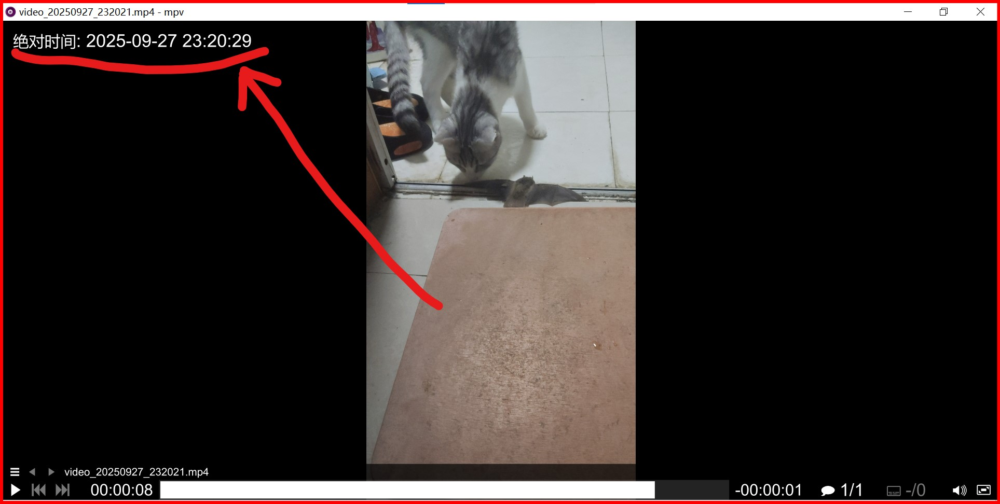

## Tigger/Cause/Start

~~We~~ I want mpv can show absolute timestamp like beijing 20251007 2:20 according to ~~create time~~ modify date when playing audio or video file , so we can know the exactly time of the specified sound wave or action picture happen in the .m4a or .mp4 file.  

Because vivo phone internal camera do not have timestamp like hikvision osd when capturing video, and it's hard work(high battery consumption,~~china~~ india too poor) to process the video file to add timestamp,  _we need player to finish the work_.  

Because of create date maybe wrong due to copied file,_we use modify date_.  

(en) (cn)script differ in comment，_same in code_.  

## How to use

I use portable version of mpv,so put the script to **\Desktop\execute\MPV\portable_config\scripts** works.  

**Dev details see docs**.  

## Test/Behavior/Example/Finish
picture  below is behavior when testing:we can fastly know the exactly time that cat-caught-the-bat  is  around 202509272320(Beijing Time).  

